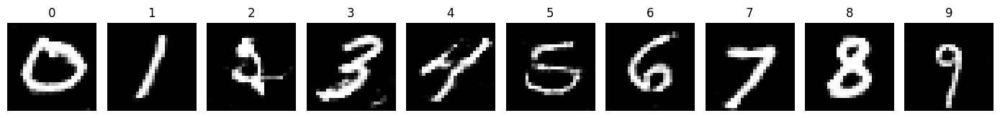
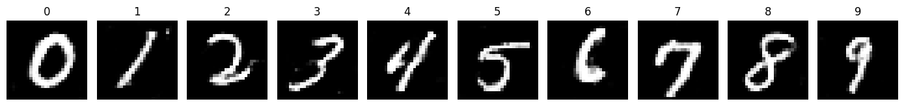
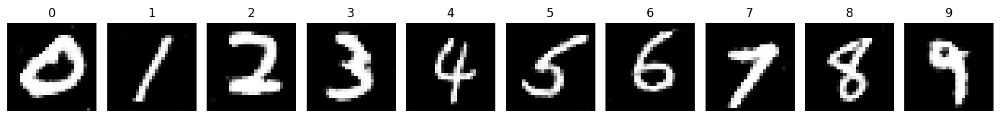

# MNIST Generator (Notebook)

این پروژه یک نوت‌بوک ژوپیتر برای **تولید تصاویر اعداد دست‌نویس دیتاست MNIST** با استفاده از یک مدل مولد است.  
در نوت‌بوک مراحل بارگذاری داده، آماده‌سازی، تعریف مدل، آموزش و در نهایت تولید و نمایش نمونه‌ها انجام می‌شود.

---

## ویژگی‌ها
- بارگذاری دیتاست MNIST
- پیش‌پردازش و نرمال‌سازی داده‌ها
- تعریف مدل مولد و اجزای آموزش
- آموزش مدل
- تولید و نمایش نمونه‌های جدید
- امکان ذخیره/بازیابی مدل (در صورت فعال بودن سلول‌های مربوطه)

---

## پیش‌نیازها
- Python 3.x
- PyTorch
- torchvision
- matplotlib
- Jupyter Notebook / JupyterLab

نصب پیشنهادی:
```bash
pip install torch torchvision matplotlib notebook
```
## اجرا
پروژه را کلون/دانلود کنید.
نوت‌بوک را اجرا کنید:
```bash
jupyter notebook MNIST-generator.ipynb
```

## ساختار پروژه
```text
MNIST-generator/
├─ notebook/
│  ├─ MNIST-generator.ipynb
│  └─ helper.py
├─ models/
│  └─ cgan-MNIST.pt
├─ data/
│  ├─ mnist_trian.pt
│  └─ mnist_test.pt
└─ images/
```
## Project Images

### Samples




