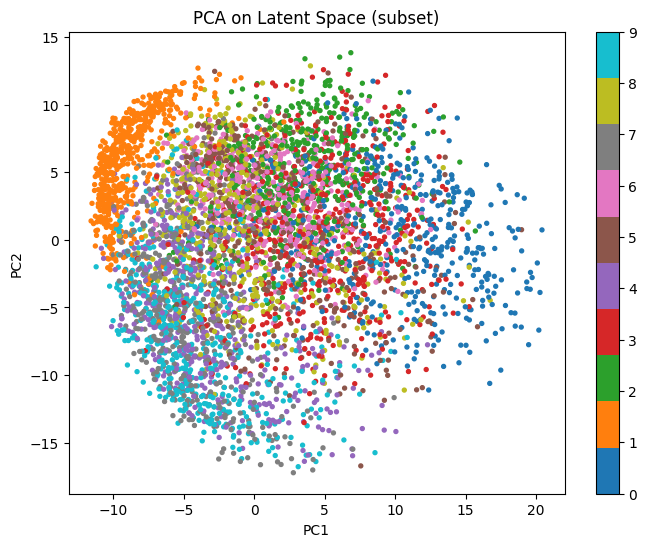
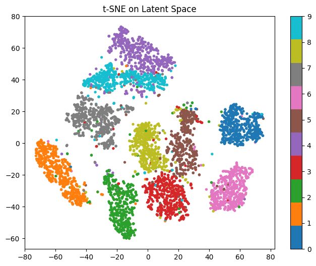

# MNIST-unsupervised-analysis

پروژه‌ی **MNIST-unsupervised-analysis** مجموعه‌ای از نوت‌بوک‌ها برای **تحلیل بدون‌ناظر (Unsupervised)** روی دیتاست MNIST است. در این پروژه:
- با **Autoencoder** ویژگی‌های نهفته (Latent Features) استخراج می‌شوند.
- فضای نهفته به‌صورت **۲ بعدی** برای نمایش مستقیم بصری‌سازی می‌شود.
- برای فضای نهفته با ابعاد بالاتر (**۶۴ بعدی**) از روش‌های **کاهش بعد (PCA و t-SNE)** استفاده می‌شود.
- همچنین یک نمونه **خوشه‌بندی با KMeans** روی نمایش ویژگی‌ها/داده انجام می‌گیرد.

---

## Features / Notebooks
- **MNIST-clustering-kmeans.ipynb**  
  خوشه‌بندی داده‌ها با الگوریتم KMeans و بررسی ساختار خوشه‌ها.

- **MNIST-Visulized-2D-Encoder.ipynb**  
  آموزش/استفاده از Autoencoder با **Encoder دو بعدی** برای نمایش مستقیم فضای نهفته (2D Latent Space).

- **MNIST-Visulized-64D-Encoder.ipynb**  
  آموزش/استفاده از Autoencoder با **Encoder شصت‌وچهار بعدی** و سپس کاهش بعد با **PCA** و **t-SNE** برای بصری‌سازی.

---

## Requirements
برای اجرای نوت‌بوک‌ها، این موارد پیشنهاد می‌شود:
- Python 3.8+
- `tensorflow`
- `numpy`
- `scikit-learn`
- `matplotlib`
- `seaborn` (اختیاری)
- `jupyter` / `notebook` یا `jupyterlab`

نصب سریع:
```bash
pip install tensorflow numpy scikit-learn matplotlib seaborn jupyter
``` 
## ساختار پروژه
```text
MNIST-unsupervised-analysis/
├── _data/
│   ├── mnist.npz
│   └── mnist_classes.npz
├── _images/
│   ├── 0.png
│   ├── 1.png
│   ├── ...
│   ├── 9.png
│   ├── latent.png
│   ├── decoding.png
│   ├── PCA.png
│   └── t-sen.png
└── _models/
├── MNIST-clustering-kmeans.ipynb
├── MNIST-Visulized-2D-Encoder.ipynb
└── MNIST-Visulized-64D-Encoder.ipynb
```
### Samples

**نمونه بازسازی تصاویر توسط Decoder (Decoding / Reconstruction):**


**نمایش فضای نهفته دو بعدی (Encoder 2D):**


**نمایش فضای نهفته دو بعدی برای هر عدد (0 تا 9) — (Encoder 2D):**
<p align="center">
  
  
  
  
  
</p>
<p align="center">
  
  
  
  
  
</p>

**کاهش بعد از فضای نهفته 64 بعدی با PCA (Encoder 64D → PCA):**


**کاهش بعد از فضای نهفته 64 بعدی با t-SNE (Encoder 64D → t-SNE):**


