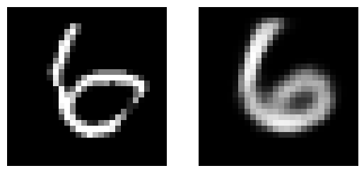
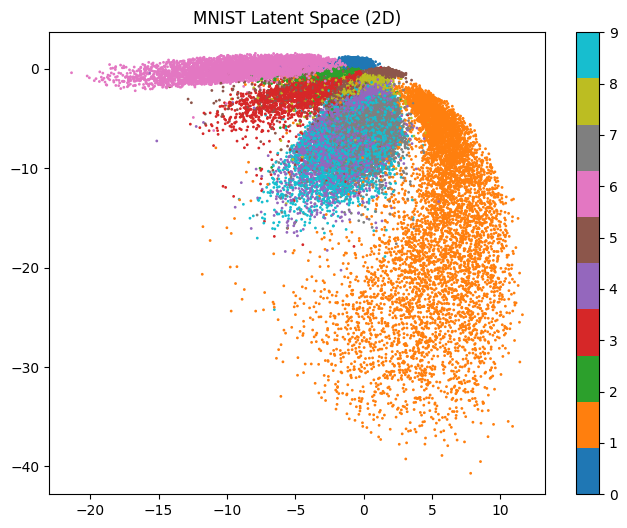
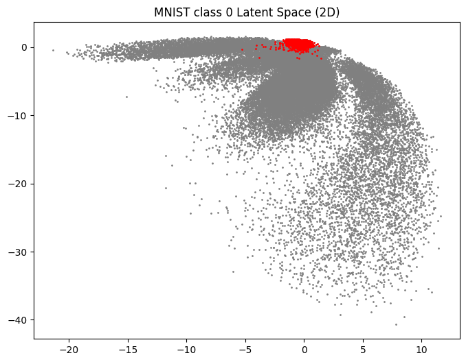
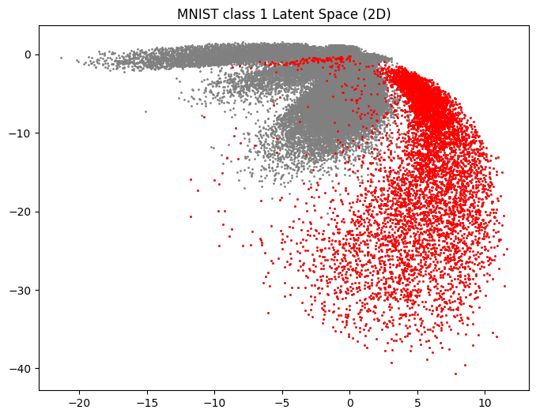
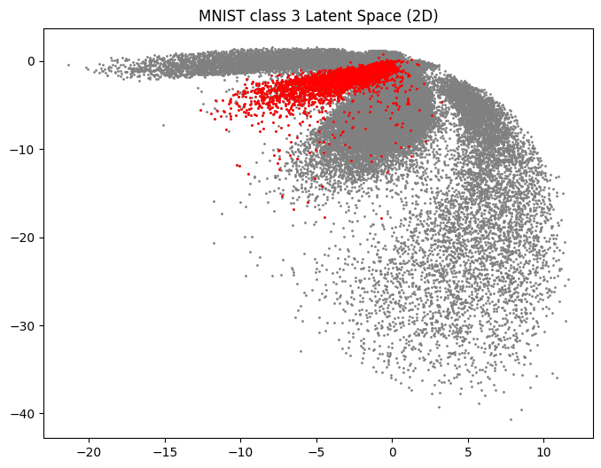
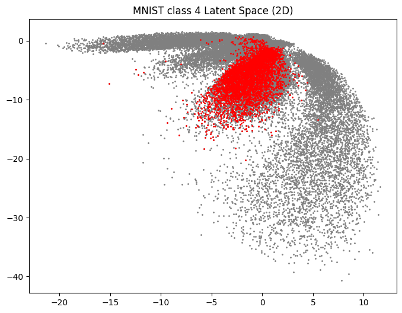
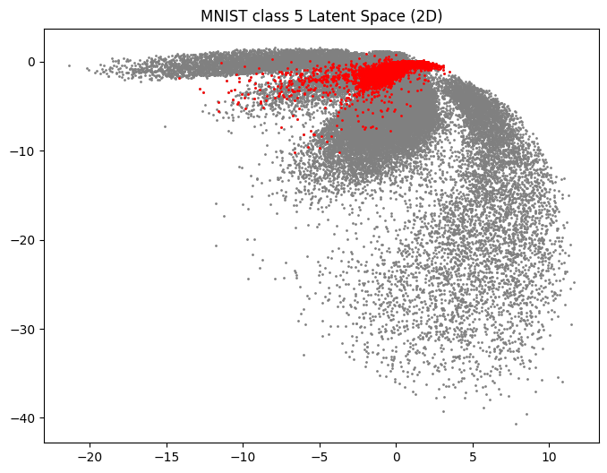
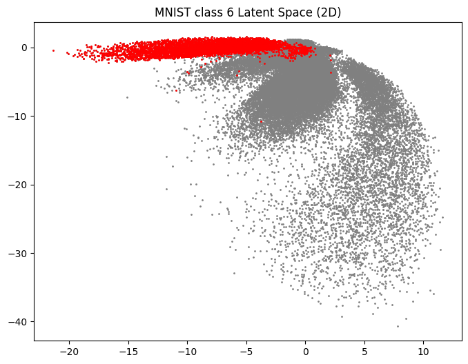
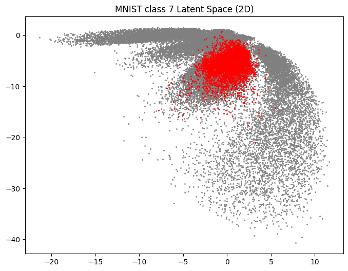
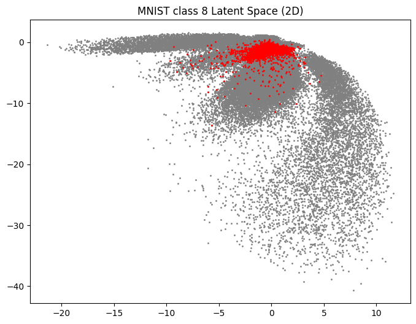

# 🔢 فشرده‌سازی دوبعدی داده‌های MNIST با Convolutional Autoencoder

این پروژه یک **Convolutional Autoencoder** برای مجموعه‌داده‌ی **MNIST** پیاده‌سازی می‌کند که هدف آن تبدیل هر تصویر رقم دست‌نویس به یک **بردار نهفته‌ی دوبعدی (2D Latent Space)** است.  
پس از آموزش، می‌توان نحوه‌ی توزیع ارقام مختلف را در فضای نهفته مشاهده کرد و میزان جداسازی کلاس‌ها را تحلیل نمود.

---

## 📌 ایده‌ی اصلی پروژه

در این نوت‌بوک، یک مدل **Autoencoder** طراحی شده است که:

- تصویر ورودی MNIST را دریافت می‌کند
- آن را با استفاده از بخش **Encoder** به یک نمایش فشرده‌ی دوبعدی تبدیل می‌کند
- سپس با استفاده از بخش **Decoder** تصویر را از روی این نمایش فشرده بازسازی می‌کند

هدف اصلی پروژه:

- **کاهش ابعاد** داده‌های تصویری MNIST به فضای 2 بعدی
- **بازسازی تصویر** از روی نمایش نهفته
- **نمایش و تحلیل فضای نهفته** برای بررسی نحوه‌ی توزیع کلاس‌های مختلف

---

## 🧠 معماری مدل

مدل از سه بخش اصلی تشکیل شده است:

### 1) Encoder
بخش Encoder تصویر ورودی با ابعاد `28×28×1` را به یک بردار دوبعدی تبدیل می‌کند.

#### ساختار Encoder:
- `Conv2D(32, kernel_size=3, activation='relu', padding='same')`
- `MaxPooling2D(2)`
- `Conv2D(64, kernel_size=3, activation='relu', padding='same')`
- `MaxPooling2D(2)`
- `Flatten()`
- `Dense(128, activation='relu')`
- `Dense(2, activation='linear')`

✅ خروجی نهایی این بخش یک بردار دوبعدی است که نمایش فشرده‌ی تصویر را نگه می‌دارد.

---

### 2) Decoder
بخش Decoder بردار نهفته‌ی دوبعدی را گرفته و تلاش می‌کند تصویر اصلی را بازسازی کند.

#### ساختار Decoder:
- `Dense(128, activation='relu')`
- `Dense(7 * 7 * 64, activation='relu')`
- `Reshape((7, 7, 64))`
- `Conv2DTranspose(64, kernel_size=3, strides=2, padding='same', activation='relu')`
- `Conv2DTranspose(32, kernel_size=3, strides=2, padding='same', activation='relu')`
- `Conv2D(1, kernel_size=3, padding='same', activation='sigmoid')`

✅ خروجی این بخش یک تصویر بازسازی‌شده با ابعاد `28×28×1` است.

---

### 3) Autoencoder
در نهایت Encoder و Decoder به هم متصل شده‌اند تا مدل کامل Autoencoder ساخته شود.

#### تنظیمات آموزش:
- **Optimizer:** `adam`
- **Loss Function:** `binary_crossentropy`
- **Metric:** `accuracy`

---

## 📂 داده‌ها و پیش‌پردازش

در این پروژه، داده‌های MNIST از فایل زیر بارگذاری می‌شوند:
```python
../data/mnist.npz
```
### نمونه کد:
```python
with np.load("../data/mnist.npz") as data:
    x_train_raw, y_train = data["x_train"], data["y_train"]
    x_test_raw, y_test = data["x_test"], data["y_test"]

x_train = x_train_raw.reshape(-1, 28, 28, 1) / 255.0
x_test = x_test_raw.reshape(-1, 28, 28, 1) / 255.0
```


## 🏋️ آموزش مدل
مدل به‌صورت خودنظارتی آموزش می‌بیند؛ یعنی ورودی و خروجی یکسان هستند و مدل یاد می‌گیرد تصویر را بازسازی کند.

### تنظیمات آموزش:
```
epochs = 5
batch_size = 64
validation_split = 0.1
```
### کد آموزش:
```python
history = autoencoder.fit(
x_train,
x_train,
epochs=5,
batch_size=64,
validation_split=0.1
)
```
## 💾 ذخیره و بارگذاری مدل
پس از آموزش، مدل‌ها ذخیره می‌شوند تا بعداً دوباره قابل استفاده باشند.

### فایل‌های ذخیره‌شده:
```
../models/autoencoder_2D.keras
../models/encoder_2D.
```
### نمونه کد:
```python
autoencoder.save("../models/autoencoder_2D.keras")
encoder.save("../models/encoder_2D.keras")
```
### و سپس در صورت نیاز:

```python
from tensorflow.keras.models import 

autoencoder = load_model("../models/autoencoder_2D.keras")
encoder = load_model("../models/encoder_2D.keras")
```
## 🖼️ بازسازی تصاویر
برای بررسی عملکرد مدل، یک نمونه به‌صورت تصادفی از داده‌های آموزش انتخاب شده و سپس تصویر بازسازی‌شده تولید می‌شود.

### ایده:
انتخاب یک تصویر تصادفی
عبور آن از Autoencoder
مقایسه‌ی تصویر اصلی و بازسازی‌شده
نمونه کد:
```python
seed = np.random.randint(0, 60000)
img = x_train[seed:seed+1]
pre_img = autoencoder.predict(img)
```
<p align="center">
  

این بخش برای ارزیابی کیفی مدل بسیار مفید است، چون نشان می‌دهد Autoencoder تا چه حد توانسته اطلاعات مهم تصویر را حفظ کند.

## 📉 استخراج فضای نهفته‌ی دوبعدی
بعد از آموزش، همه‌ی تصاویر مجموعه‌ی train توسط Encoder به بردارهای دوبعدی تبدیل می‌شوند:

```python
latent_vectors = encoder.predict(x_train)
```
### خروجی این مرحله دارای شکل زیر است:

```python
(60000, 2)
```
یعنی برای هر تصویر MNIST، یک نقطه در فضای دوبعدی داریم.

## 🎨 نمایش فضای نهفته
یکی از مهم‌ترین بخش‌های این پروژه، رسم نقاط فضای نهفته است.

### در این نمودار:

هر نقطه متناظر با یک تصویر از MNIST است
مختصات نقطه از خروجی Encoder به‌دست می‌آید
رنگ هر نقطه بر اساس کلاس واقعی آن تعیین می‌شود
### هدف این visualization:
بررسی میزان جداسازی کلاس‌ها
مشاهده‌ی خوشه‌بندی ارقام مختلف
تحلیل کیفیت نمایش نهفته‌ی یادگرفته‌شده
این نمودار با عنوانی مشابه زیر رسم شده است:
<p align="center">
  
  
## 🔍 تحلیل کلاس‌به‌کلاس
در نوت‌بوک، علاوه بر نمایش کلی فضای نهفته، یک بخش دیگر نیز برای تحلیل جداگانه‌ی هر کلاس در نظر گرفته شده است.

### در این بخش:

داده‌ها از فایل `../data/mnist_classes.npz` بارگذاری می‌شوند
نمونه‌های هر کلاس به‌صورت جداگانه encode می‌شوند
برای هر رقم، نمایش جداگانه‌ای در فضای نهفته رسم می‌شود
### این کار کمک می‌کند:

رفتار مدل برای هر کلاس بهتر دیده شود
میزان پراکندگی یا تمرکز هر رقم بررسی شود
هم‌پوشانی بین کلاس‌ها تحلیل شود

## 🖼️ نمونه خروجی‌های مدل

در این بخش چند نمونه از بازسازی تصاویر توسط Autoencoder نمایش داده شده است.

<p align="center">
  
  
  
  
  
  
</p>

<p align="center">
  
  
  
  
  
</p>

## 🚀 کاربردهای این پروژه
### این پروژه فقط یک بازسازی ساده‌ی تصویر نیست، بلکه مفاهیم مهمی را پوشش می‌دهد:

Dimensionality Reduction

Representation Learning

Latent Space 

Image Reconstruction

Visualization of Learned Features

## 🛠️ تکنولوژی‌های استفاده‌شده
Python

NumPy

Matplotlib

TensorFlow / Keras

## ▶️ نحوه اجرا
### 1) نصب پیش‌نیازها
```bash
pip install tensorflow numpy matplotlib
```
### 2) اجرای نوت‌بوک
فایل نوت‌بوک را در Jupyter اجرا کنید:

```bash
jupyter notebook MNIST_2D_Encoding.ipynb
```
## 📁 خروجی‌های پروژه
### پس از اجرای پروژه، موارد زیر تولید یا استفاده می‌شوند:

مدل Autoencoder ذخیره‌شده
مدل Encoder ذخیره‌شده
تصویر بازسازی‌شده از نمونه‌ها
نمودار فضای نهفته‌ی دوبعدی
نمودارهای مربوط به تحلیل کلاس‌به‌کلاس
## ✅ جمع‌بندی
در این پروژه، یک Convolutional Autoencoder برای مجموعه‌داده‌ی MNIST پیاده‌سازی شده که هر تصویر را به یک بردار دوبعدی نگاشت می‌کند.

این نمایش فشرده، علاوه بر امکان بازسازی تصویر، ابزار بسیار خوبی برای تحلیل ساختار داده‌ها و نمایش فضای نهفته فراهم می‌کند.

### اگر به موضوعاتی مثل:

یادگیری نمایش
کاهش ابعاد
تحلیل فضای latent
و autoencoderها
علاقه دارید، این پروژه یک نمونه‌ی ساده اما بسیار کاربردی برای شروع است.

## 📌 نکات قابل توسعه
### پیشنهادهایی برای توسعه‌ی پروژه:

افزایش تعداد epochها برای بهبود کیفیت بازسازی

مقایسه‌ی latent space دوبعدی و سه‌بعدی

استفاده از Variational Autoencoder (VAE)

بررسی عملکرد مدل روی داده‌های دیگر مانند Fashion-MNIST

افزودن نمودار loss و validation loss در طول آموزش
