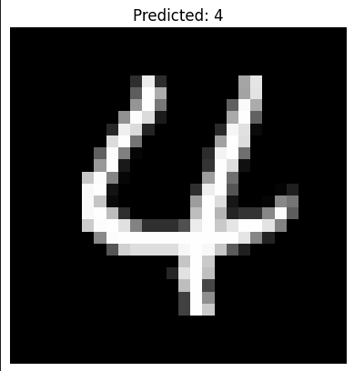
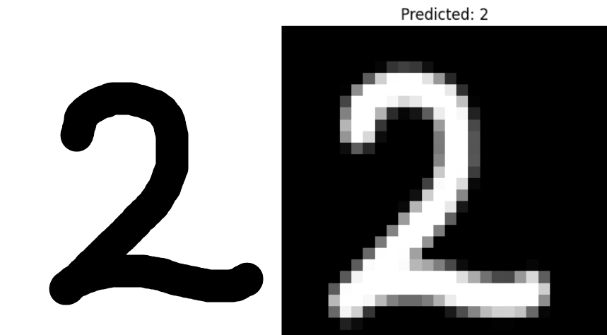

# پیش‌بینی اعداد دست‌نویس (MNIST)

پروژه‌ای برای تشخیص اعداد دست‌نویس با استفاده از دو نوع شبکه عصبی: **شبکه کاملاً متصل (DENS)** و **شبکه کانولوشنی (CNN)** روی دیتاست MNIST.

---

## 📁 ساختار پروژه

```
predict_numbers/
├── data/              # دیتاست MNIST
│   └── mnist.npz      # فایل دیتاست
├── image/             # تصاویر تست
│   ├── 1.png
│   ├── 2.png
│   └── 3.png
├── models/            # وزن‌های مدل‌های آموزش‌دیده
│   ├── DENS.h5        # مدل Fully Connected
│   └── CNN.h5         # مدل Convolution
├── notebook/          # نوت‌بوک‌ها
│   ├── DENS.ipynb     # تست مدل Fully Connected
│   └── CNN.ipynb      # تست مدل Convolution
├── picture.png        # تصویر مقایسه ورودی و پیش‌بینی مدل
├── predict.png        # تصویر خروجی پیش‌بینی مدل
└── README.md
```

---

## 📦 پیش‌نیازها و نصب کتابخانه‌ها

### پیش‌نیازها

- **Python** 3.8 یا بالاتر
- pip (مدیر بسته‌های پایتون)

### نصب کتابخانه‌ها

برای اجرای پروژه، کتابخانه‌های زیر را نصب کنید:

```bash
pip install tensorflow numpy matplotlib pillow opencv-python
```

یا در صورت استفاده از `requirements.txt`:

```bash
pip install -r requirements.txt
```

---

## 🗄️ دسترسی به دیتاست MNIST

دیتاست MNIST در فایل **`data/mnist.npz`** ذخیره شده است. برای استفاده:

### روش ۱: استفاده مستقیم از فایل موجود

اگر فایل `mnist.npz` در پوشه `data/` موجود است:

```python
import numpy as np

with np.load("data/mnist.npz") as data:
    x_train, y_train = data["x_train"], data["y_train"]
    x_test, y_test   = data["x_test"], data["y_test"]
```

### روش ۲: دانلود و ذخیره از Keras

در صورت نبود فایل، می‌توانید آن را دانلود و ذخیره کنید:

```python
import numpy as np
from tensorflow.keras.datasets import mnist

(x_train, y_train), (x_test, y_test) = mnist.load_data()
np.savez("data/mnist.npz", x_train=x_train, y_train=y_train, x_test=x_test, y_test=y_test)
```

### دانلود دستی

می‌توانید فایل را از [لینک رسمی MNIST](https://storage.googleapis.com/tensorflow/tf-keras-datasets/mnist.npz) دانلود کرده و در پوشه `data/` قرار دهید.

---

## 🤖 توضیح مدل‌ها

### مدل DENS (Fully Connected)

**نوت‌بوک:** `notebook/DENS.ipynb`

شبکه عصبی کاملاً متصل است که تصویر ۲۸×۲۸ را به بردار ۷۸۴ پیکسلی تبدیل کرده و از طریق لایه‌های Dense پردازش می‌کند.

**معماری مدل:**

| لایه | نوع | توضیحات |
|------|------|---------|
| ۱ | Dense (128) | ورودی ۷۸۴، فعال‌سازی ReLU |
| ۲ | Dense (64)  | فعال‌سازی ReLU |
| ۳ | Dense (10)  | خروجی ۱۰ کلاس، فعال‌سازی Softmax |

**نمونه کد ساخت مدل DENS:**

```python
from tensorflow.keras import layers, models

model = models.Sequential([
    layers.Dense(128, activation='relu', input_shape=(784,)),
    layers.Dense(64, activation='relu'),
    layers.Dense(10, activation='softmax')
])

model.compile(
    optimizer='adam',
    loss='sparse_categorical_crossentropy',
    metrics=['accuracy']
)
```

**بارگذاری مدل DENS:**

```python
from tensorflow.keras.models import load_model

model = load_model("models/DENS.h5")
```

---

### مدل CNN (Convolutional Neural Network)

**نوت‌بوک:** `notebook/CNN.ipynb`

شبکه کانولوشنی است که ویژگی‌های مکانی تصویر را استخراج می‌کند و معمولاً دقت بهتری دارد.

**معماری مدل:**

| لایه | نوع | توضیحات |
|------|------|---------|
| ۱ | Input | ورودی ۲۸×۲۸×۱ |
| ۲ | Rescaling | نرمال‌سازی مقادیر پیکسل |
| ۳ | Conv2D (32) | فیلتر ۳×۳، ReLU |
| ۴ | MaxPooling2D | پولینگ ۲×۲ |
| ۵ | Conv2D (64) | فیلتر ۳×۳، ReLU |
| ۶ | MaxPooling2D | پولینگ ۲×۲ |
| ۷ | Flatten | تبدیل به بردار |
| ۸ | Dense (128) | ReLU |
| ۹ | Dense (10)  | Softmax |

**نمونه کد ساخت مدل CNN:**

```python
from tensorflow.keras import layers, models

model = models.Sequential([
    layers.Input(shape=(28, 28, 1)),
    layers.Rescaling(1./255),
    layers.Conv2D(32, (3,3), activation='relu'),
    layers.MaxPooling2D((2,2)),
    layers.Conv2D(64, (3,3), activation='relu'),
    layers.MaxPooling2D((2,2)),
    layers.Flatten(),
    layers.Dense(128, activation='relu'),
    layers.Dense(10, activation='softmax')
])

model.compile(
    optimizer='adam',
    loss='sparse_categorical_crossentropy',
    metrics=['accuracy']
)
```

**بارگذاری مدل CNN:**

```python
import tensorflow as tf

model = tf.keras.models.load_model("models/CNN.h5")
```

---


## ▶️ اجرای نوت‌بوک‌ها

### اجرا با Jupyter Notebook

```bash
cd predict_numbers
jupyter notebook notebook/DENS.ipynb
jupyter notebook notebook/CNN.ipynb
```

### اجرا با JupyterLab

```bash
cd predict_numbers
jupyter lab notebook/
```

### اجرا با VS Code

فایل‌های `.ipynb` را در VS Code باز کرده و سلول‌ها را به‌صورت متوالی اجرا کنید.

---

## 📝 روش‌های تست مدل

### ۱. استفاده از تصاویر دیتاست MNIST

```python
import numpy as np

# انتخاب تصویر تصادفی از دیتاست
sample_image = x_train_raw[np.random.randint(0, 60000)]
predict_images(model, sample_image)
```


### ۲. استفاده از عکس دست‌نویس (پوشه `image/`)

```python
image = image_to_mnist("image/2.png")
predict_images(model, image)
```

### ۳. رسم عدد با موس

در نوت‌بوک سلولی وجود دارد که با آن می‌توانید با موس عدد بنویسید و پس از فشردن Enter، پیش‌بینی مدل را ببینید.

---

## 📋 جمع‌بندی

| مورد | مسیر / مقدار |
|------|--------------|
| دیتاست | `data/mnist.npz` |
| مدل Fully Connected | `models/DENS.h5` |
| مدل Convolution | `models/CNN.h5` |
| نوت‌بوک DENS | `notebook/DENS.ipynb` |
| نوت‌بوک CNN | `notebook/CNN.ipynb` |
| تصاویر تست | `image/1.png`, `image/2.png`, `image/3.png` |

---

**موفق باشید.**
